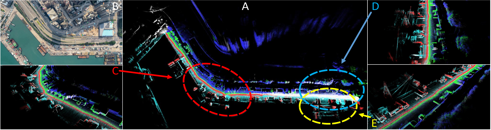
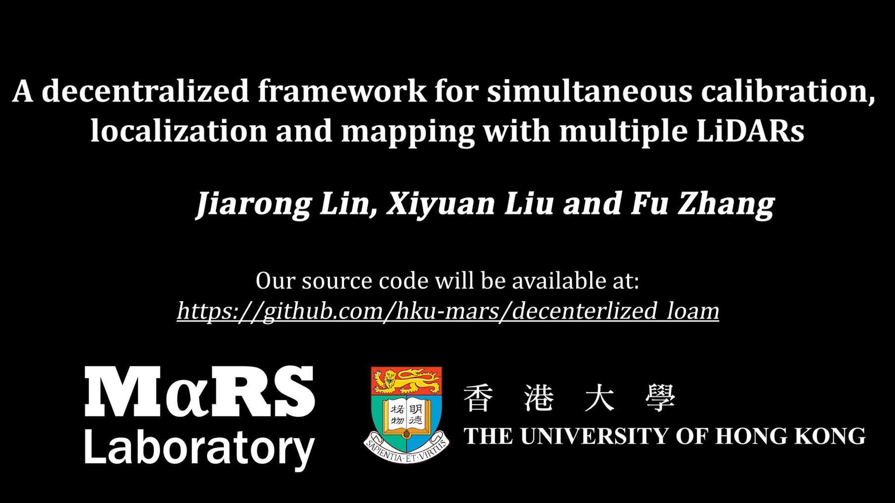
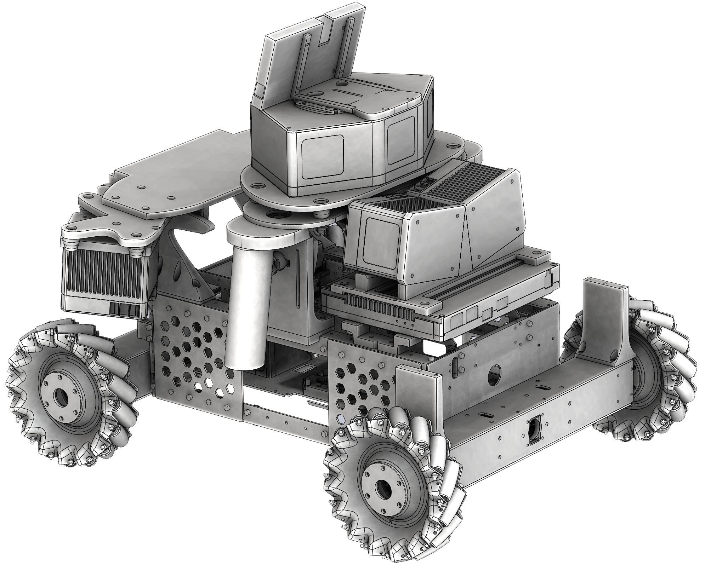
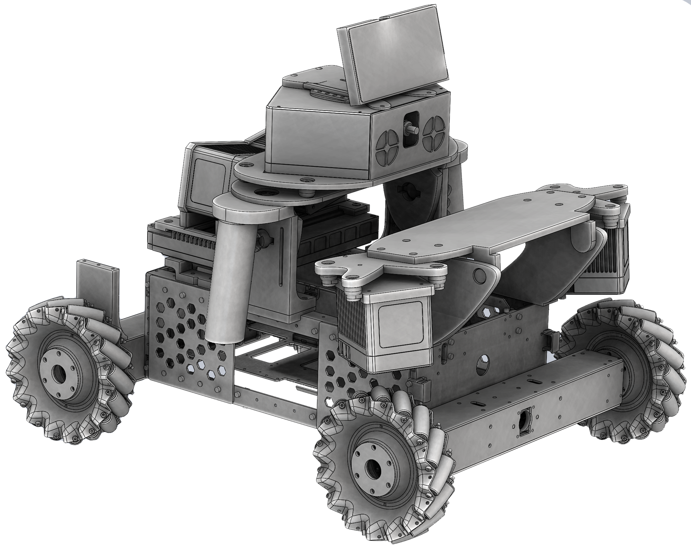
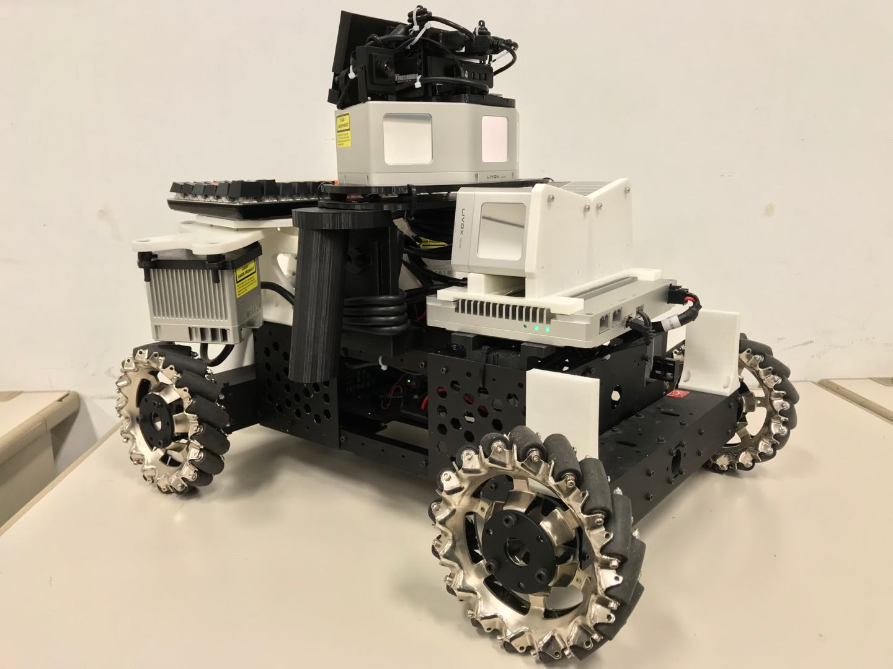
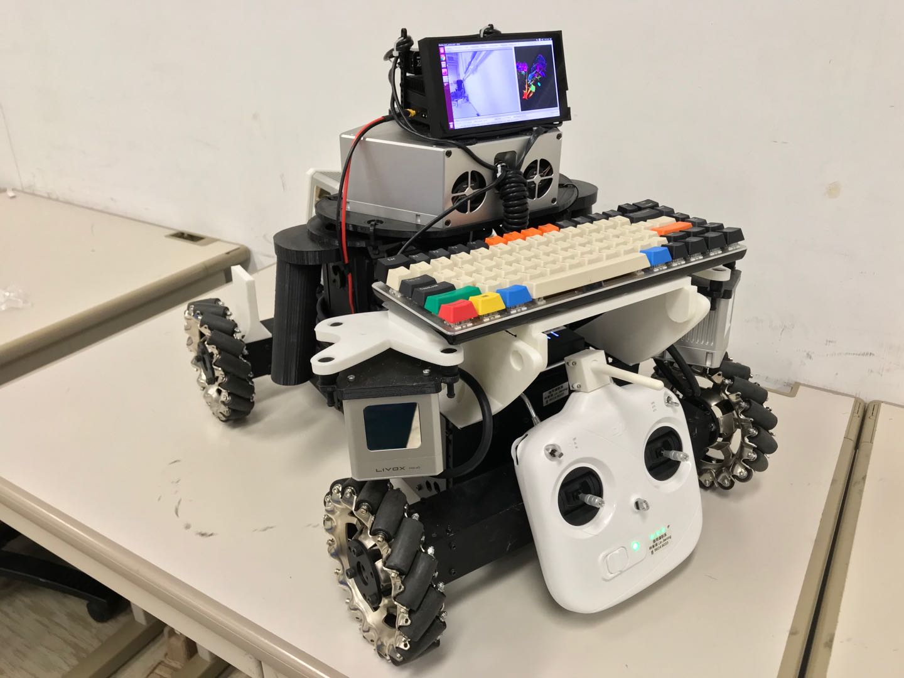

# Decentralized_loam
* The code will be released soon.
## A decentralized framework for simultaneous calibration, localization and mapping with multiple LiDARs

    
    (A). The bird's eye-view of the maps we reconstructed in one of our experiments. The point cloud data sampled from different LiDARs are rendered with different colors. (B). The satellite image of the experiment test ground; (C~E). The detailed inspection of the area marked in dashed circle in A.

# Introduction
**Decentralized_loam** is the code implementation of our paper "A decentralized framework for simultaneous calibration, localization and mapping with multiple LiDARs", which is developed based on our previous work [Loam-livox](https://github.com/hku-mars/loam_livox). Our project fuses data from multiple LiDARs in a decentralized framework, which can not only address the problem of localization and mapping, but can also online calibrate the extrinsic of 6-DoF (includes 3-DoF of rotation and 3-DoF of translation). 

**Developer:** [Jiarong Lin](https://github.com/ziv-lin)

**Our related video**: our related videos are now available on YouTube (click below image to open):

# Our hardware design
Not only our codes and algorithms are of open-source, but also our hardware design. You can visit this project ([https://github.com/hku-mars/lidar_car_platfrom](https://github.com/hku-mars/lidar_car_platfrom)) for more details :)

    <a href="https://github.com/hku-mars/lidar_car_platfrom" target="_blank">
    <a href="https://github.com/hku-mars/lidar_car_platfrom" target="_blank">

    
    </a>

# License
The source code is released under [GPLv2](http://www.gnu.org/licenses/) license.

We are still working on improving the performance and reliability of our codes. For any technical issues, please contact me via email Jiarong Lin < ziv.lin.ljr@gmail.com >.

For commercial use, please contact Dr. Fu Zhang < fuzhang@hku.hk >
